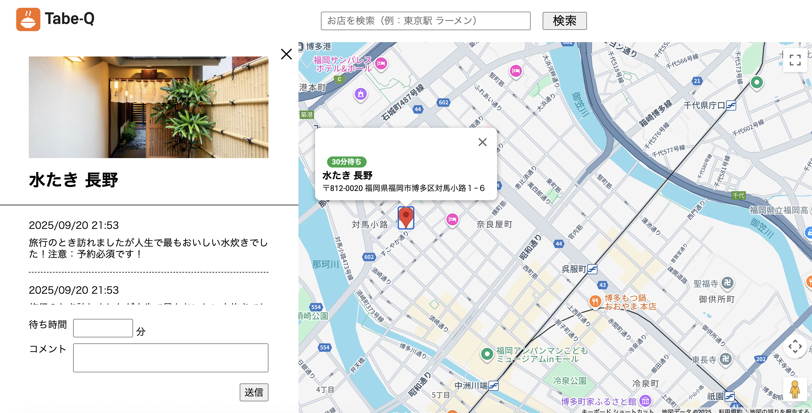

🍜 Tabe-Q

Q = 行列（Queue）  
飲食店の待ち行列を共有できる SNS。ゆるく使えて、混雑状況の見える化を目的としたアプリ。

📌 アプリ概要

- 飲食店の混雑状況をユーザー同士で共有
- 「時間のないお昼休憩中のサラリーマン」「なかなか入れない行列店へ気軽に」などの利用を想定
- 行列や待ち時間を見える化

🌐 実際のアプリ

- [Tabe-Q : https://springs-five.vercel.app/](https://springs-five.vercel.app/)

📸 画像イメージ
アプリイメージ:  

QR コード:  

🏗 開発背景・コンセプト

- 背景: Yahoo 天気の「みんなの投稿」のようなゆるい投稿 SNS を作りたい
- コンセプト: 飲食店の待ち時間共有 SNS。混雑状況を可視化することで、行列回避や計画立てに役立つ

🛠 技術スタック

- 言語: TypeScript (Full-Stack)
- フロントエンド: Vue.js
- バックエンド: Node.js + Express
- デプロイ: フロントエンド → Vercel / バックエンド → Railway
- 外部 API: Google Maps API

🗺 主な機能

- Google マップ画面ベースの UI
- 店舗検索機能
- 検索結果・投稿するとマップ上にピンが立つ
- ピンをクリック → 吹き出しで待ち時間、モーダルで店舗情報と投稿フォーム・投稿一覧を表示
- 投稿内容は 1 時間以内のものに New マークが付与され、鮮度の高い情報をわかりやすく表示

🎯 ユーザビリティ向上のための推奨拡張

- 投稿の削除・編集
- 待ち時間によってピンを色分け（例: 1 時間以内は赤、それ以外は青）
- ユーザー管理機能

📑 ハッカソン情報

- 参加ハッカソン: stady-basic-hackson  
  [https://pg-beginner-mtg.connpass.com/](https://pg-beginner-mtg.connpass.com/)
